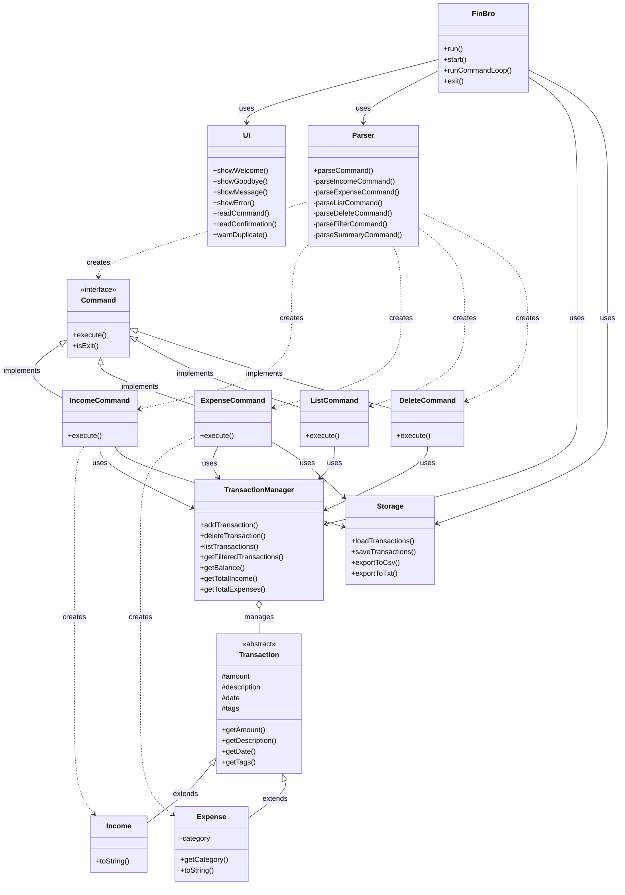
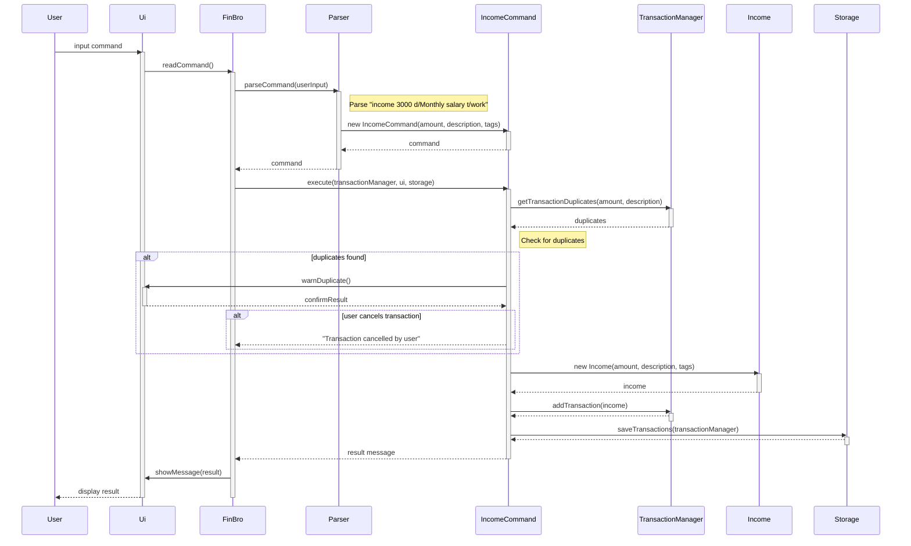

# FinBro Developer Guide

## Introduction

FinBro is a personal finance management application that operates through a Command Line Interface (CLI). This developer guide provides comprehensive information about the architecture, implementation, and design decisions behind FinBro to help developers understand the codebase and contribute effectively.

## Setting Up the Development Environment

### Prerequisites
- JDK 17
- Gradle 7.6.2 or higher
- IntelliJ IDEA (recommended)

### Getting Started

1. Clone the repository:
   ```
   git clone https://github.com/AY2425S2-CS2113-W13-3/tp.git
   ```

2. Import the project as a Gradle project in IntelliJ IDEA:
   - Open IntelliJ IDEA
   - Select "Import Project"
   - Navigate to the project directory and select the `build.gradle` file
   - Follow the prompts to complete the import

3. Verify the setup:
   - Run the tests: `./gradlew test`
   - Run the application: `./gradlew run`

## Architecture

FinBro follows a layered architecture pattern with clear separation of concerns:



### Component Overview

#### 1. Main Component (`FinBro.java`)
- Serves as the entry point of the application
- Coordinates interactions between other components
- Manages the main execution flow

#### 2. UI Component (`Ui.java`)
- Handles all user interaction through the command line
- Displays messages, prompts, and results to the user
- Captures and forwards user input to the parser

#### 3. Logic Component
- **Parser (`Parser.java`)**: Converts user input into command objects
- **Command Classes**: Implement specific functionalities using the Command pattern

#### 4. Model Component
- **Transaction Classes**: Define the core data structures
- **TransactionManager**: Manages the collection of transactions
- Implements business logic and operations on the data model

#### 5. Storage Component (`Storage.java`)
- Handles persistence of data
- Manages saving and loading of transaction data
- Supports data export in various formats

### Class Structure

```
seedu.finbro/
├── FinBro.java                 # Main class
├── logic/
│   ├── command/
│   │   ├── Command.java         # Command interface
│   │   ├── IncomeCommand.java
│   │   ├── ExpenseCommand.java
│   │   └── ...                  # Other command implementations
│   └── parser/
│       └── Parser.java          # Input parser
├── model/
│   ├── Transaction.java         # Abstract base class
│   ├── Income.java
│   ├── Expense.java
│   └── TransactionManager.java  # Business logic
├── storage/
│   └── Storage.java             # Data persistence
└── ui/
    └── Ui.java                  # User interface
```

## Sequence Diagrams

### Adding a Transaction

The following sequence diagram illustrates the basic process when a user adds a new transaction:

```
User -> FinBro: input command
FinBro -> Parser: parseCommand(userInput)
Parser -> IncomeCommand: new IncomeCommand(...)
Parser --> FinBro: command
FinBro -> IncomeCommand: execute()
IncomeCommand -> TransactionManager: addTransaction(income)
IncomeCommand -> Storage: saveTransactions()
IncomeCommand --> FinBro: result message
FinBro -> Ui: showMessage(result)
Ui --> User: display result
```

Here's a more detailed sequence diagram showing the flow for adding an income transaction, including duplicate transaction checking:




## Design Patterns

FinBro implements several design patterns to enhance maintainability and extensibility:

### 1. Command Pattern
All user actions are encapsulated as command objects implementing the `Command` interface. This allows for:
- Uniform handling of different commands
- Easy addition of new commands
- Support for operations like undo/redo (future enhancement)

### 2. Singleton Pattern
The `TransactionManager` is implemented as a singleton to ensure:
- Only one instance manages the transactions
- Consistent state across the application
- Centralized access to transaction data

### 3. Factory Method Pattern
The `Parser` class serves as a factory, creating appropriate command objects based on user input. Benefits include:
- Encapsulation of command creation logic
- Separation of command execution from creation
- Enhanced extensibility when adding new commands

### 4. Model-View-Controller (MVC)
The application follows an MVC-like structure:
- **Model**: `Transaction` classes and `TransactionManager`
- **View**: `Ui` class
- **Controller**: `Command` classes and `FinBro` class

## Implementation Details

### Key Features

#### 1. Transaction Management Feature

##### Overview

The Transaction Management feature is a core component of FinBro that allows users to add, delete, search, and filter financial transactions. Transactions can be either income or expenses, each with different attributes and behaviors.

This section explains the design considerations and implementation details of the Transaction Management system, focusing on adding and deleting transactions.

##### Design Considerations

###### Transaction Hierarchy

The Transaction Management system uses inheritance to model different types of financial transactions:

* `Transaction` (abstract): Base class that defines common attributes and behaviors
   * `Income`: Extends Transaction, representing money received
   * `Expense`: Extends Transaction, representing money spent, with additional attributes like category

This approach provides several benefits:
1. Code reuse through inheritance of common attributes and methods
2. Polymorphism enabling operations on collections of different transaction types
3. Type safety provided by Java's type system

###### Alternative Designs Considered

**1. Single Transaction Class with Type Enum**

```java
class Transaction {
    enum Type { INCOME, EXPENSE }
    private Type type;
    private Category category; // Only used for expenses
    // Other fields
}
```

This approach was rejected because:
- It would lead to optional fields that are only relevant for specific transaction types
- Type safety would rely on runtime checks rather than compile-time enforcement
- Would violate the Single Responsibility Principle by having one class handle multiple concerns

**2. Composition-based Approach**

```java
class Transaction {
    private TransactionDetails details;
    // Common fields
}

interface TransactionDetails { }
class IncomeDetails implements TransactionDetails { }
class ExpenseDetails implements TransactionDetails { }
```

This approach was considered but not implemented because:
- Added complexity without significant benefits for our use case
- Inheritance provided a cleaner solution for the current requirements

##### Implementation Details

###### Adding a Transaction

The process of adding a transaction involves several components interacting together:

1. **UI** captures the user input
2. **Parser** interprets the command and creates the appropriate Command object
3. **Command** (e.g., IncomeCommand, ExpenseCommand) creates the transaction object
4. **TransactionManager** stores the transaction
5. **Storage** persists the transaction to disk

###### Duplicate Detection

The system checks for potential duplicate transactions based on amount and description:

```java
public ArrayList<Transaction> getTransactionDuplicates(double amount, String description) {
    assert description != null : "Description cannot be null";
    assert amount > 0 : "Amount must be greater than zero";
    return transactions.stream()
        .filter(t -> (t.getDescription().equals(description) && t.getAmount() == amount ))
        .collect(Collectors.toCollection(ArrayList::new));
}
```

If duplicates are found, the user is warned and prompted to confirm before proceeding:

```java
if (!transactionManager.getTransactionDuplicates(amount, description).isEmpty()) {
    if (!ui.warnDuplicate()) {
        return "Transaction cancelled by user";
    }
}
```

This helps prevent accidental duplication of transactions while still allowing intentional repetition.

###### Deleting a Transaction

Deleting a transaction follows a similar component interaction pattern:

1. **UI** captures the delete command with an index
2. **Parser** creates a DeleteCommand with the specified index
3. **DeleteCommand** removes the transaction from TransactionManager
4. **Storage** persists the updated transaction list

Implementation details:

```java
public void deleteTransaction(int index) {
    assert index >= 0 : "Index must be non-negative";
    assert index < transactions.size() : "Index must be within the bounds of the transaction list";

    if (index < 1 || index > transactions.size()) {
        logger.warning("Attempt to delete transaction at invalid index: " + index);
        throw new IndexOutOfBoundsException("Transaction index out of range: " + index);
    }
    Transaction removed = transactions.remove(index - INDEX_OFFSET); // Convert from 1-based to 0-based
    
    // Update the index numbers for all transactions after the deleted one
    for (int i = index; i < transactions.size(); i++) {
        transactions.get(i).indexNum -= INDEX_OFFSET;
    }
    
    logger.info("Deleted " + removed.getClass().getSimpleName() +
            " with amount $" + removed.getAmount() +
            " at index " + index);
}
```

The implementation maintains proper indexing by updating the index numbers of all transactions following the deleted one.

###### Class Diagram of Transaction Component

```
Transaction (abstract)
    |
    ├── Income
    └── Expense
         └── Category (enum)
```

The Transaction class provides common attributes and methods:
- `amount`: The monetary value
- `description`: Text description of the transaction
- `date`: When the transaction occurred
- `tags`: Optional categorization labels
- `getAmount()`, `getDescription()`, etc.: Accessor methods
- `toString()`: Abstract method implemented by subclasses

##### Storage Considerations

Transactions are persisted to disk in a text file format where fields are separated by a pipe character ('|'):

```
INCOME|2025-03-15|1000.00|Salary|work
EXPENSE|2025-03-16|50.00|Groceries|FOOD|essential
```

When saving and loading transactions, the system performs conversion between the object model and this text representation. This approach was chosen for its simplicity and human readability, while still providing adequate structure for reliable parsing.

##### Defensive Programming Aspects

The Transaction Management system uses several defensive programming techniques:

1. **Assertions**: Pre-conditions and post-conditions are verified using assertions
   ```java
   assert amount > 0 : "Expense amount must be greater than zero";
   ```

2. **Logging**: Key operations are logged for debugging and auditing
   ```java
   logger.info("Added " + transaction.getClass().getSimpleName() +
           " with amount $" + transaction.getAmount());
   ```

3. **Immutability**: Transaction objects are immutable once created, preventing accidental state changes
   ```java
   public List<String> getTags() {
       return new ArrayList<>(tags); // Return a copy to prevent modification
   }
   ```

4. **Null checks**: Methods verify parameters are valid before proceeding
   ```java
   if (tags != null) { ... }
   ```

These techniques enhance the robustness of the system and make debugging easier.

#### 2. Command Parsing

The `Parser` class converts user input into appropriate command objects through several phases:
1. Tokenization of input
2. Extraction of command word
3. Parameter parsing
4. Command object creation

**Implementation Example:**
```java
public Command parseCommand(String userInput) {
   String[] parts = userInput.split("\\s+", 2);
   String commandWord = parts[0].toLowerCase();
   String arguments = parts.length > 1 ? parts[1] : "";

   switch (commandWord) {
      case "income":
         return parseIncomeCommand(arguments);
      case "expense":
         return parseExpenseCommand(arguments);
      // ... other commands
   }
}
```

#### 3. Data Persistence

The `Storage` class manages saving and loading of transaction data using a custom text-based format.

**File formats:**
- **Internal storage**: Text file with fields separated by '|' delimiter
- **Export formats**: CSV and TXT

**Implementation:**
- Transactions are serialized to text format for persistence
- Data is loaded into memory at application startup
- Changes are saved to disk after each transaction modification

#### 4. Financial Summaries

The `SummaryCommand` generates financial reports with the following capabilities:
- Filtering by time period (month/year)
- Categorized expense breakdown
- Tag-based transaction analysis
- Income vs. expense comparison

## Testing

### Structure

Tests are organized following the same package structure as the main code:

```
test/java/seedu/finbro/
├── logic/
│   ├── command/
│   │   ├── IncomeCommandTest.java
│   │   └── ...
│   └── parser/
│       └── ParserTest.java
├── model/
│   ├── TransactionTest.java
│   └── TransactionManagerTest.java
└── storage/
    └── StorageTest.java
```

### Running Tests

Run all tests:
```
./gradlew test
```

Run a specific test:
```
./gradlew test --tests "seedu.finbro.model.TransactionTest"
```

### Text UI Testing

Text UI testing verifies application behavior by comparing output against expected results:

1. Run tests:
```
cd text-ui-test
./runtest.sh
```

2. The script compares the actual output against predefined expected output.

## Future Enhancements

### Planned Features

1. **Recurring Transactions**
   - Automatic addition of regular income/expenses
   - Customizable recurrence patterns

2. **Budget Management**
   - Setting spending limits by category
   - Alerts when approaching budget thresholds
   - Visual budget utilization indicators

3. **Data Visualization**
   - Text-based charts for spending patterns
   - Trend analysis for income/expenses over time
   - Category distribution visualization

4. **Multiple Accounts**
   - Support for tracking different financial accounts
   - Transfer operations between accounts
   - Consolidated and per-account reporting

5. **Investment Tracking**
   - Basic portfolio management
   - Investment performance metrics
   - Asset allocation tracking

## Appendix

### Glossary

- **CLI**: Command Line Interface
- **Transaction**: Any financial event (income or expense)
- **Tag**: User-defined label for categorizing transactions
- **Category**: Predefined classification for expenses

### References

- Java SE 17 Documentation
- JUnit 5 User Guide
- Gradle User Manual