# FinBro Developer Guide

## Table of Contents
1. [Introduction](#introduction)
2. [Setting Up the Development Environment](#setting-up-the-development-environment)
3. [High-Level Architecture](#high-level-architecture)
4. [Component Details](#component-details)
   - [Main Component](#main-component)
   - [UI Component](#ui-component)
   - [Logic Component](#logic-component)
   - [Model Component](#model-component)
   - [Storage Component](#storage-component)
   - [Command Classes](#command-classes)
   - [Exceptions Component](#exceptions-component)
5. [Class Structure](#class-structure)
6. [Design Patterns](#design-patterns)
7. [Key Features and Implementation](#key-features-and-implementation)
   - [Transaction Management](#transaction-management-feature)
   - [Command Parsing](#command-parsing)
   - [Data Persistence](#data-persistence)
   - [Financial Summaries](#financial-summaries)
8. [Sequence Diagrams for Key Operations](#sequence-diagrams-for-key-operations)
   - [Adding a Transaction](#adding-a-transaction)
   - [Searching for a Transaction](#searching-for-a-transaction)
   - [Filtering Transactions](#filtering-transactions)
   - [Obtaining a Monthly Financial Summary](#obtaining-a-monthly-financial-summary)
   - [Obtaining the Current List of Transactions](#obtaining-the-current-list-of-transactions)
   - [Viewing Balance](#viewing-balance)
   - [Editing a Transaction](#editing-a-transaction)
9. [Testing](#testing)
10. [Future Enhancements](#future-enhancements)
11. [Appendix](#appendix)
   - [Glossary](#glossary)
   - [References](#references)

## Introduction

FinBro is a personal finance management application that operates through a Command Line Interface (CLI). This developer guide provides comprehensive information about the architecture, implementation, and design decisions behind FinBro to help developers understand the codebase and contribute effectively.

## Setting Up the Development Environment

### Prerequisites
- JDK 17
- Gradle 7.6.2 or higher
- IntelliJ IDEA (recommended)

### Getting Started

1. Clone the repository:
   ```
   git clone https://github.com/AY2425S2-CS2113-W13-3/tp.git
   ```

2. Import the project as a Gradle project in IntelliJ IDEA:
   - Open IntelliJ IDEA
   - Select "Import Project"
   - Navigate to the project directory and select the `build.gradle` file
   - Follow the prompts to complete the import

3. Verify the setup:
   - Run the tests: `./gradlew test`
   - Run the application: `./gradlew run`

## High-Level Architecture

FinBro follows a layered architecture pattern with clear separation of concerns:

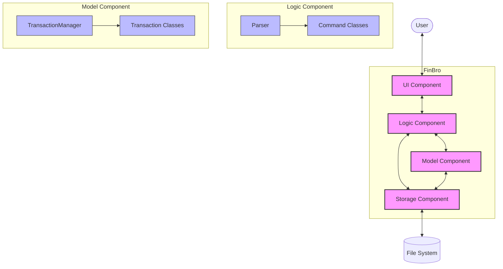

## Component Details

### Main Component

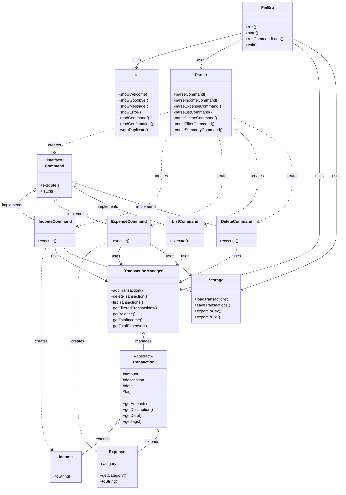

### UI Component

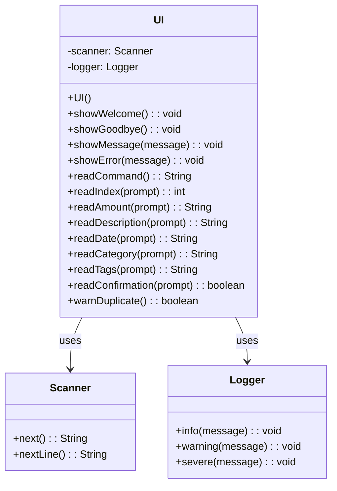

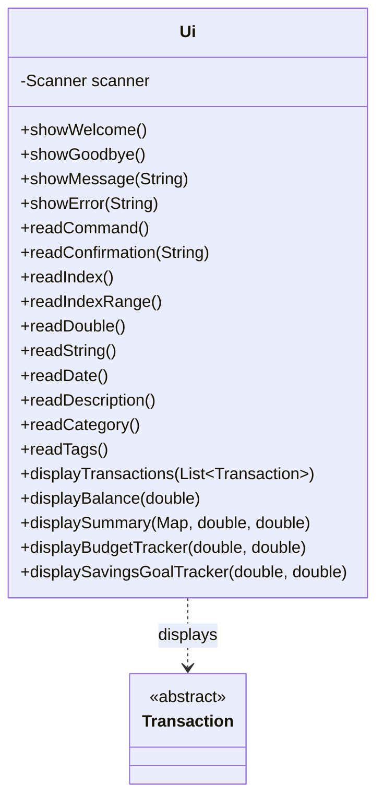

### Logic Component

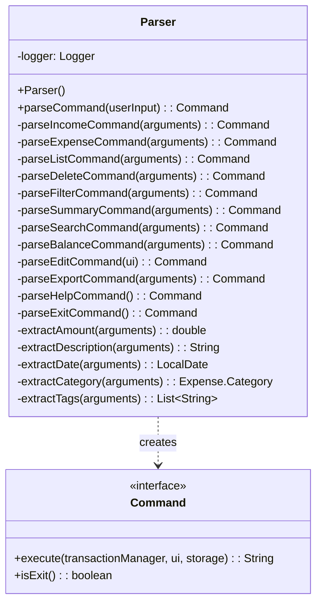

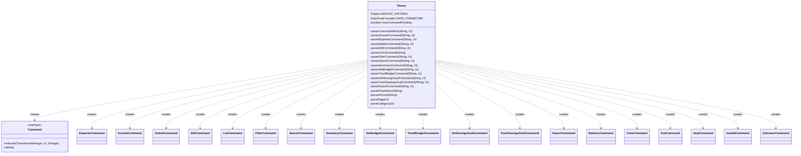

### Model Component

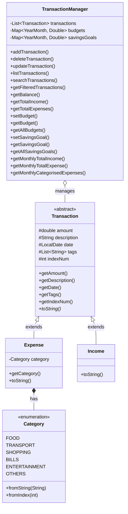

### Storage Component

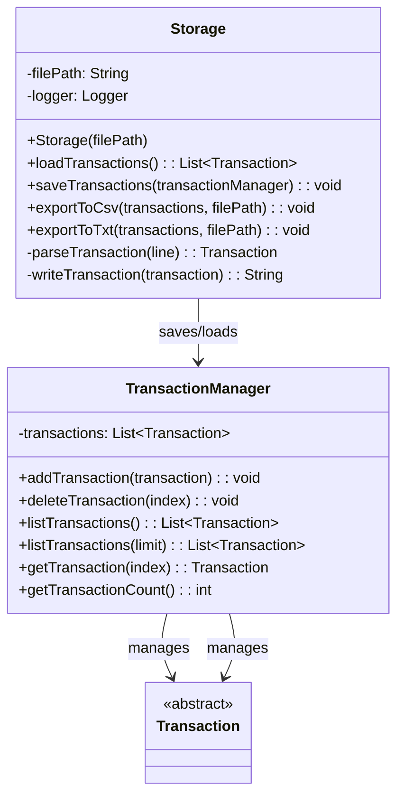

```mermaid
paste in content of storage-detail-class.mermaid
```

### Command Classes

```mermaid
paste in content of command-class.mermaid
```

```mermaid
paste in content of command-detail-class.mermaid
```

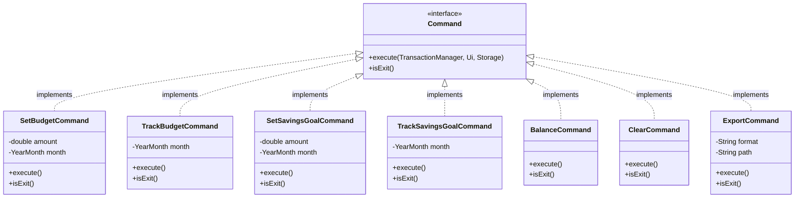

### Exceptions Component

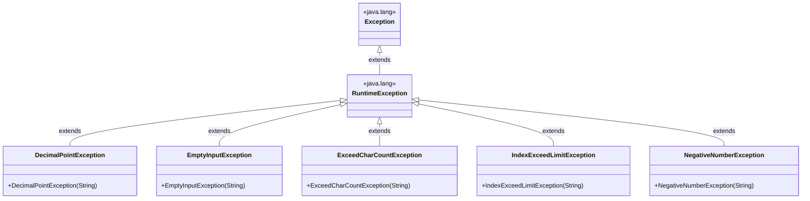

## Class Structure

```
seedu.finbro/
├── FinBro.java                 # Main class
├── logic/
│   ├── command/
│   │   ├── Command.java         # Command interface
│   │   ├── IncomeCommand.java
│   │   ├── ExpenseCommand.java
│   │   └── ...                  # Other command implementations
│   └── parser/
│       └── Parser.java          # Input parser
├── model/
│   ├── Transaction.java         # Abstract base class
│   ├── Income.java
│   ├── Expense.java
│   └── TransactionManager.java  # Business logic
├── storage/
│   └── Storage.java             # Data persistence
└── ui/
    └── Ui.java                  # User interface
```

## Design Patterns

FinBro implements several design patterns to enhance maintainability and extensibility:

### 1. Command Pattern
All user actions are encapsulated as command objects implementing the `Command` interface. This allows for:
- Uniform handling of different commands
- Easy addition of new commands
- Support for operations like undo/redo (future enhancement)

### 2. Singleton Pattern
The `TransactionManager` is implemented as a singleton to ensure:
- Only one instance manages the transactions
- Consistent state across the application
- Centralized access to transaction data

### 3. Factory Method Pattern
The `Parser` class serves as a factory, creating appropriate command objects based on user input. Benefits include:
- Encapsulation of command creation logic
- Separation of command execution from creation
- Enhanced extensibility when adding new commands

### 4. Model-View-Controller (MVC)
The application follows an MVC-like structure:
- **Model**: `Transaction` classes and `TransactionManager`
- **View**: `Ui` class
- **Controller**: `Command` classes and `FinBro` class

## Key Features and Implementation

### Transaction Management Feature

#### Overview

The Transaction Management feature is a core component of FinBro that allows users to add, delete, search, and filter financial transactions. Transactions can be either income or expenses, each with different attributes and behaviors.

This section explains the design considerations and implementation details of the Transaction Management system, focusing on adding and deleting transactions.

#### Design Considerations

##### Transaction Hierarchy

The Transaction Management system uses inheritance to model different types of financial transactions:

* `Transaction` (abstract): Base class that defines common attributes and behaviors
   * `Income`: Extends Transaction, representing money received
   * `Expense`: Extends Transaction, representing money spent, with additional attributes like category

This approach provides several benefits:
1. Code reuse through inheritance of common attributes and methods
2. Polymorphism enabling operations on collections of different transaction types
3. Type safety provided by Java's type system

##### Alternative Designs Considered

**1. Single Transaction Class with Type Enum**

```java
class Transaction {
    enum Type { INCOME, EXPENSE }
    private Type type;
    private Category category; // Only used for expenses
    // Other fields
}
```

This approach was rejected because:
- It would lead to optional fields that are only relevant for specific transaction types
- Type safety would rely on runtime checks rather than compile-time enforcement
- Would violate the Single Responsibility Principle by having one class handle multiple concerns

**2. Composition-based Approach**

```java
class Transaction {
    private TransactionDetails details;
    // Common fields
}

interface TransactionDetails { }
class IncomeDetails implements TransactionDetails { }
class ExpenseDetails implements TransactionDetails { }
```

This approach was considered but not implemented because:
- Added complexity without significant benefits for our use case
- Inheritance provided a cleaner solution for the current requirements

#### Implementation Details

##### Adding a Transaction

The process of adding a transaction involves several components interacting together:

1. **UI** captures the user input
2. **Parser** interprets the command and creates the appropriate Command object
3. **Command** (e.g., IncomeCommand, ExpenseCommand) creates the transaction object
4. **TransactionManager** stores the transaction
5. **Storage** persists the transaction to disk

##### Duplicate Detection

The system checks for potential duplicate transactions based on amount and description:

```java
public ArrayList<Transaction> getTransactionDuplicates(double amount, String description) {
    assert description != null : "Description cannot be null";
    assert amount > 0 : "Amount must be greater than zero";
    return transactions.stream()
        .filter(t -> (t.getDescription().equals(description) && t.getAmount() == amount ))
        .collect(Collectors.toCollection(ArrayList::new));
}
```

If duplicates are found, the user is warned and prompted to confirm before proceeding:

```java
if (!transactionManager.getTransactionDuplicates(amount, description).isEmpty()) {
    if (!ui.warnDuplicate()) {
        return "Transaction cancelled by user";
    }
}
```

This helps prevent accidental duplication of transactions while still allowing intentional repetition.

##### Deleting a Transaction

Deleting a transaction follows a similar component interaction pattern:

1. **UI** captures the delete command with an index
2. **Parser** creates a DeleteCommand with the specified index
3. **DeleteCommand** removes the transaction from TransactionManager
4. **Storage** persists the updated transaction list

Implementation details:

```java
public void deleteTransaction(int index) {
    assert index >= 0 : "Index must be non-negative";
    assert index < transactions.size() : "Index must be within the bounds of the transaction list";

    if (index < 1 || index > transactions.size()) {
        logger.warning("Attempt to delete transaction at invalid index: " + index);
        throw new IndexOutOfBoundsException("Transaction index out of range: " + index);
    }
    Transaction removed = transactions.remove(index - INDEX_OFFSET); // Convert from 1-based to 0-based
    
    // Update the index numbers for all transactions after the deleted one
    for (int i = index; i < transactions.size(); i++) {
        transactions.get(i).indexNum -= INDEX_OFFSET;
    }
    
    logger.info("Deleted " + removed.getClass().getSimpleName() +
            " with amount $" + removed.getAmount() +
            " at index " + index);
}
```

The implementation maintains proper indexing by updating the index numbers of all transactions following the deleted one.

##### Viewing of Balance

The balance viewing feature follows this component interaction pattern:
1. **UI** captures the balance command with optional date parameters
2. **Parser** creates a BalanceCommand with specified date parameters
3. **BalanceCommand** requests balance calculation from TransactionManager
4. **TransactionManager** calculates balance based on all or filtered transactions
5. **BalanceCommand** formats and returns the balance information
6. **UI** displays the formatted balance to the user

**Implementation Details**

**Date-Filtered Balance Calculation**
```java
public String execute(TransactionManager transactionManager, Ui ui, Storage storage) {
   assert transactionManager != null : "TransactionManager cannot be null";
   assert ui != null : "UI cannot be null";
   assert storage != null : "Storage cannot be null";

   logger.info("Executing balance command");

   double balance = transactionManager.getBalance();
   double totalIncome = transactionManager.getTotalIncome();
   double totalExpenses = transactionManager.getTotalExpenses();

   // Verify the relationship between balance, income, and expenses
   assert Math.abs((totalIncome - totalExpenses) - balance) < 0.001 :
           "Balance calculation error: " + balance + " != " + totalIncome + " - " + totalExpenses;

   String formattedBalance = CURRENCY_FORMAT.format(balance);
   String formattedIncome = CURRENCY_FORMAT.format(totalIncome);
   String formattedExpenses = CURRENCY_FORMAT.format(totalExpenses);

   return "Current Balance: " + formattedBalance + "\n" +
           "Total Income: " + formattedIncome + "\n" +
           "Total Expenses: " + formattedExpenses;
}
```
**Key Design Features**

1. Flexible date filtering: Users can view overall balance or balance from a specific date
2. Comprehensive information: Shows income, expenses, and net balance in a single view
3. Clean formatting: Presents financial information in a well-organized, readable format
4. Integration with budgeting: Displays budget status when applicable
5. Error handling: Validates date parameters and provides clear error messages
6. Separation of concerns: Calculation logic remains in TransactionManager while presentation is handled by BalanceCommand

This implementation provides users with a quick overview of their financial position, either overall or from a specific date forward, enhancing financial awareness.

##### Editing a Transaction

Editing a transaction also follows a similar component interaction pattern:

1. **UI** captures the edit command with a keyword and parameters to update
2. **Parser** creates an EditCommand with the specified keyword and parameters
3. **UI** asks for user confirmation before proceeding
4. **EditCommand** retrieves and updates the transaction at the specified index
5. **TransactionManager** updates the transaction in its collection
6. **Storage** persists the updated transaction list

**Implementation Details**

**Index-Based Transaction Selection**

```java
public String execute(TransactionManager transactionManager, Ui ui, Storage storage) {
   // Check if index is valid (1-based indexing for user interface)
   if (index < 1 || index > transactionManager.getTransactionCount()) {
      return "Invalid index. Please provide a valid transaction index.";
   }

   try {
      // Get original transaction (accounting for INDEX_OFFSET)
      Transaction originalTransaction = transactionManager.getTransaction(index - 1);

      // Create updated transaction based on parameters
      Transaction updatedTransaction = createUpdatedTransaction(originalTransaction, parameters);

      if (updatedTransaction != null) {
         // Replace transaction at index
         transactionManager.updateTransactionAt(index - 1, updatedTransaction);
         storage.saveTransactions(transactionManager);
         return "Transaction at index " + index + " successfully updated:\n" + updatedTransaction;
      }
      return "Failed to update transaction.";
   } catch (Exception e) {
      logger.log(Level.WARNING, "Error updating transaction", e);
      return "Failed to update transaction: " + e.getMessage();
   }
}
```

**User Confirmation via UI**

The parseEditCommand method in Parser.java now includes a confirmation step:
```java
private Command parseEditCommand(Ui ui) {
    try {
        // Get index of transaction to edit
        int index = ui.readIndex("Enter the index of transaction to edit:\n> ");
        
        // Add confirmation step
        boolean confirmed = ui.readConfirmation("Do you want to edit transaction at index " + index + "?");
        if (!confirmed) {
            return new Command() {
                @Override
                public String execute(TransactionManager transactionManager, Ui ui, Storage storage) {
                    return "Edit operation cancelled.";
                }
                
                @Override
                public boolean isExit() {
                    return false;
                }
            };
        }
        
        // Proceed with collecting parameters for the edit
        Map<String, String> parameters = new HashMap<>();
        
        // Collect parameters with UI interaction
        String amountStr = ui.readAmount("Enter new amount (press Enter to skip):\n> ");
        if (!amountStr.isEmpty()) {
            parameters.put("a", amountStr);
        }
        
        // [Additional parameter collection]
        
        return new EditCommand(index, parameters);
    } catch (Exception e) {
        logger.log(Level.WARNING, "Error parsing edit command", e);
        return new InvalidCommand("Invalid edit command: " + e.getMessage());
    }
}
```
**Transaction Update Logic**

The selective field update approach is retained:
```java
private Transaction createUpdatedTransaction(Transaction original, Map<String, String> parameters) {
    try {
        // Default values from original transaction
        double amount = original.getAmount();
        String description = original.getDescription();
        LocalDate date = original.getDate();
        List<String> tags = new ArrayList<>(original.getTags());
        
        // Update values based on parameters
        if (parameters.containsKey("a")) {
            amount = Double.parseDouble(parameters.get("a"));
        }
        if (parameters.containsKey("d")) {
            description = parameters.get("d");
        }
        if (parameters.containsKey("date")) {
            date = LocalDate.parse(parameters.get("date"));
        }
        if (parameters.containsKey("t")) {
            tags = Arrays.asList(parameters.get("t").split(","));
        }
        
        // Create new transaction based on the type of the original
        if (original instanceof Income) {
            return new Income(amount, description, date, tags);
        } else if (original instanceof Expense) {
            Expense originalExpense = (Expense) original;
            Expense.Category category = originalExpense.getCategory();
            
            if (parameters.containsKey("c")) {
                category = Expense.Category.fromString(parameters.get("c"));
            }
            
            return new Expense(amount, description, date, category, tags);
        }
        return null;
    } catch (NumberFormatException e) {
        logger.log(Level.WARNING, "Invalid amount format in edit command", e);
        return null;
    } catch (DateTimeParseException e) {
        logger.log(Level.WARNING, "Invalid date format in edit command", e);
        return null;
    }
}
```

**Key Design Features**

1. Direct index reference: Uses explicit index numbers for unambiguous transaction targeting
2. User confirmation: Prevents accidental edits through a confirmation prompt
3. Type preservation: Maintains the original transaction type (Income or Expense)
4. Selective updates: Only modifies fields explicitly specified in the edit command
5. Robust validation: Handles invalid indices, amounts, dates, and categories
6. 1-based user indexing: Presents user-friendly 1-based indexing while using 0-based indexing internally

This implementation balances user experience with data integrity and provides clear feedback throughout the editing process.

##### Class Diagram of Transaction Component

```
Transaction (abstract)
    |
    ├── Income
    └── Expense
         └── Category (enum)
```

The Transaction class provides common attributes and methods:
- `amount`: The monetary value
- `description`: Text description of the transaction
- `date`: When the transaction occurred
- `tags`: Optional categorization labels
- `getAmount()`, `getDescription()`, etc.: Accessor methods
- `toString()`: Abstract method implemented by subclasses

#### Storage Considerations

Transactions are persisted to disk in a text file format where fields are separated by a pipe character ('|'):

```
INCOME|2025-03-15|1000.00|Salary|work
EXPENSE|2025-03-16|50.00|Groceries|FOOD|essential
```

When saving and loading transactions, the system performs conversion between the object model and this text representation. This approach was chosen for its simplicity and human readability, while still providing adequate structure for reliable parsing.

#### Defensive Programming Aspects

The Transaction Management system uses several defensive programming techniques:

1. **Assertions**: Pre-conditions and post-conditions are verified using assertions
   ```java
   assert amount > 0 : "Expense amount must be greater than zero";
   ```

2. **Logging**: Key operations are logged for debugging and auditing
   ```java
   logger.info("Added " + transaction.getClass().getSimpleName() +
           " with amount $" + transaction.getAmount());
   ```

3. **Immutability**: Transaction objects are immutable once created, preventing accidental state changes
   ```java
   public List<String> getTags() {
       return new ArrayList<>(tags); // Return a copy to prevent modification
   }
   ```

4. **Null checks**: Methods verify parameters are valid before proceeding
   ```java
   if (tags != null) { ... }
   ```

These techniques enhance the robustness of the system and make debugging easier.

### Command Parsing

The `Parser` class converts user input into appropriate command objects through several phases:
1. Tokenization of input
2. Extraction of command word
3. Parameter parsing
4. Command object creation

**Implementation Example:**
```java
public Command parseCommand(String userInput) {
   String[] parts = userInput.split("\\s+", 2);
   String commandWord = parts[0].toLowerCase();
   String arguments = parts.length > 1 ? parts[1] : "";

   switch (commandWord) {
      case "income":
         return parseIncomeCommand(arguments);
      case "expense":
         return parseExpenseCommand(arguments);
      // ... other commands
   }
}
```

### Data Persistence

The `Storage` class manages saving and loading of transaction data using a custom text-based format.

**File formats:**
- **Internal storage**: Text file with fields separated by '|' delimiter
- **Export formats**: CSV and TXT

**Implementation:**
- Transactions are serialized to text format for persistence
- Data is loaded into memory at application startup
- Changes are saved to disk after each transaction modification

### Financial Summaries

The `SummaryCommand` generates financial reports with the following capabilities:
- Filtering by time period (month/year)
- Categorized expense breakdown
- Tag-based transaction analysis
- Income vs. expense comparison

## Sequence Diagrams for Key Operations

### Adding a Transaction

This sequence diagram illustrates the process when a user adds a new transaction:

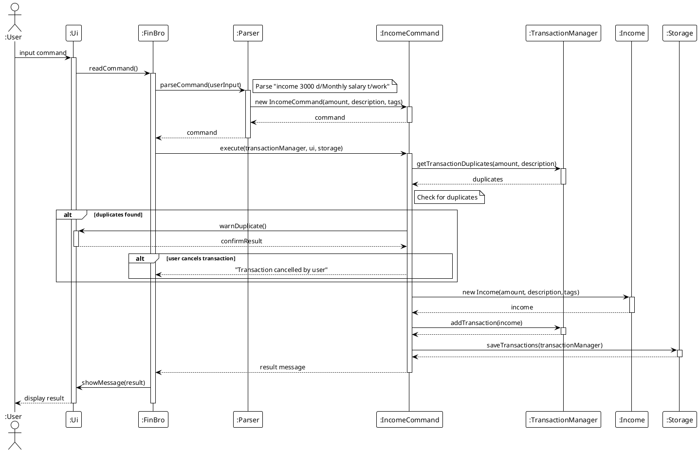

### Searching for a Transaction

This sequence diagram illustrates the process of searching for transactions:

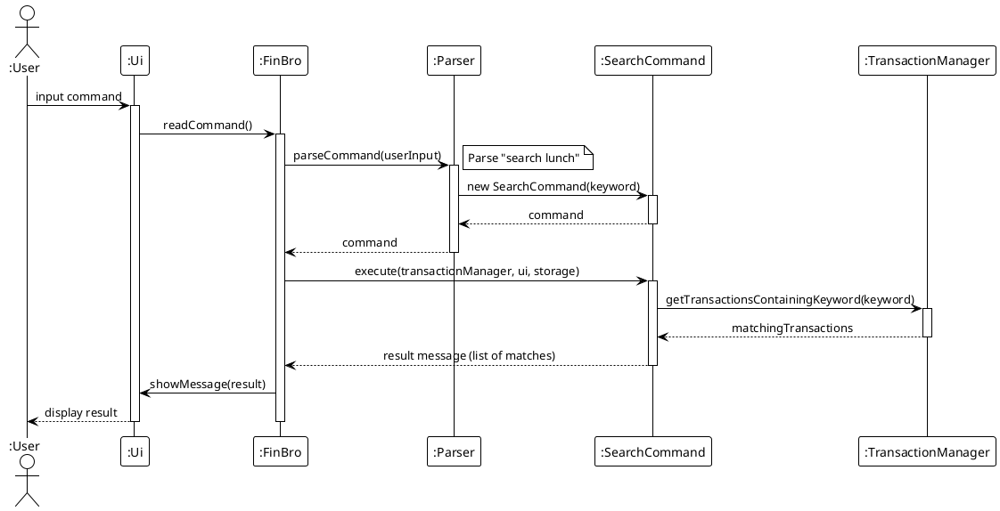

### Filtering Transactions

This sequence diagram illustrates the process of filtering transactions based on a date range:

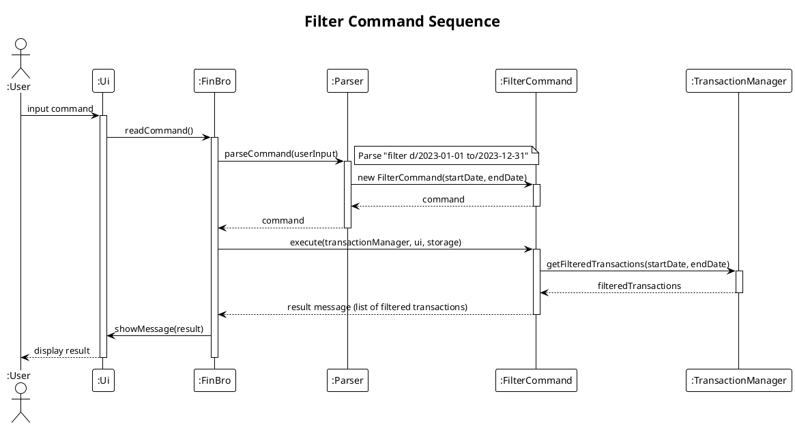

### Obtaining a Monthly Financial Summary

This sequence diagram illustrates the process of obtaining a monthly financial summary:

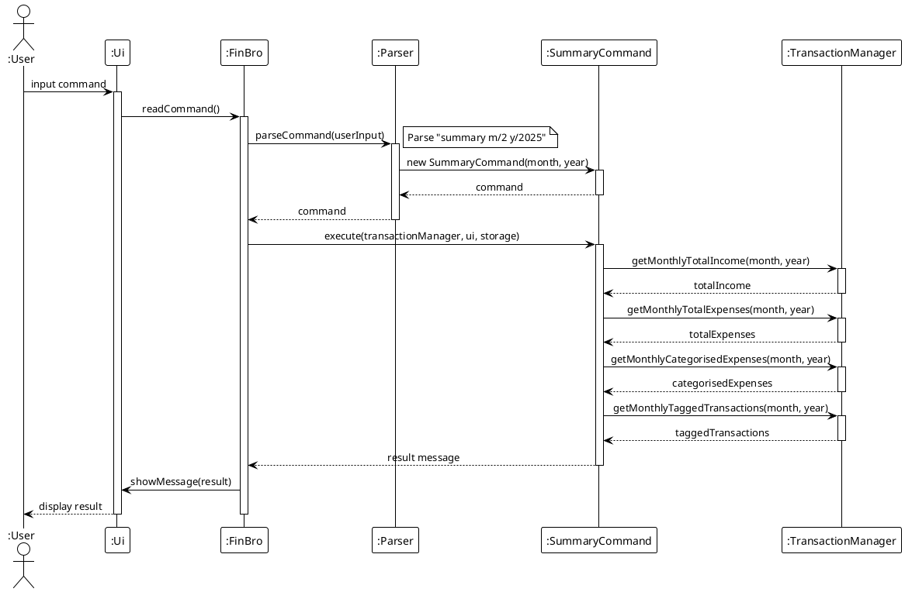

### Obtaining the Current List of Transactions

This sequence diagram illustrates the process of obtaining the current list of transactions:

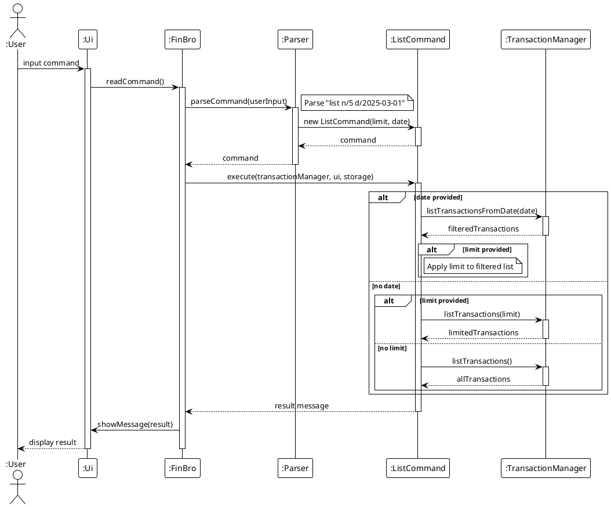

### Viewing Balance

This sequence diagram illustrates the process of viewing the current balance:

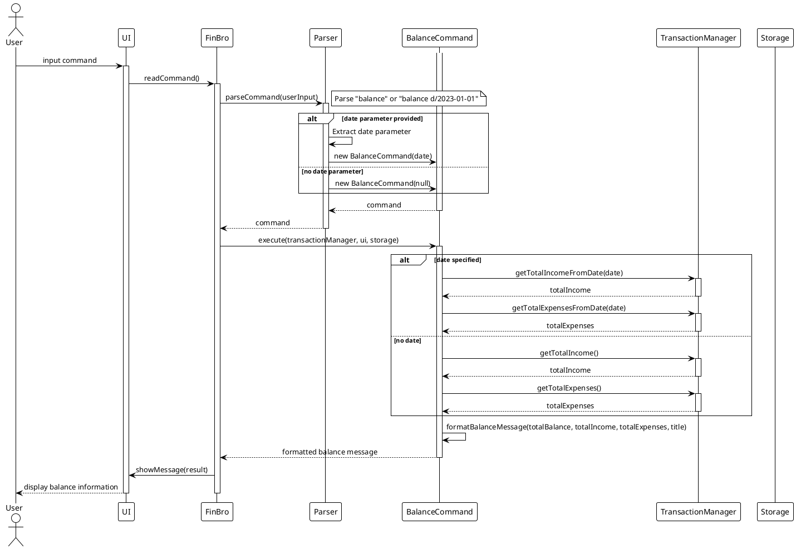

### Editing a Transaction

This sequence diagram illustrates the process of editing a transaction:
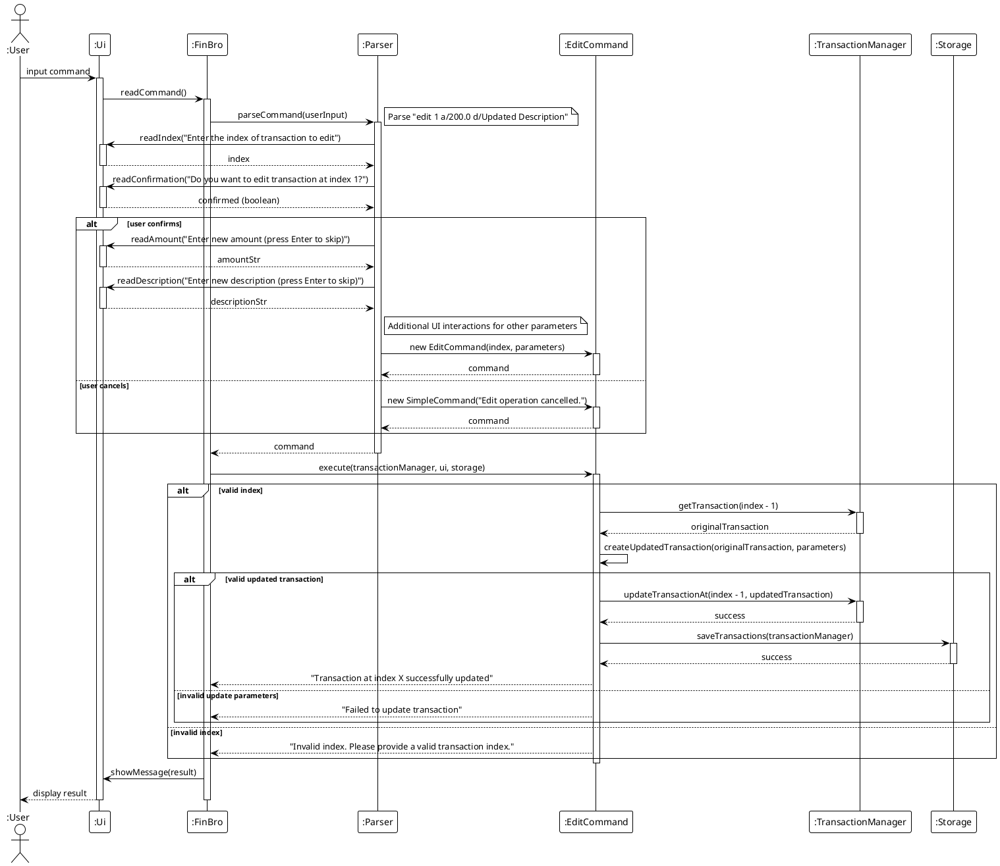

## Testing

### Structure

Tests are organized following the same package structure as the main code:

```
test/java/seedu/finbro/
├── logic/
│   ├── command/
│   │   ├── IncomeCommandTest.java
│   │   └── ...
│   └── parser/
│       └── ParserTest.java
├── model/
│   ├── TransactionTest.java
│   └── TransactionManagerTest.java
└── storage/
    └── StorageTest.java
```

### Running Tests

Run all tests:
```
./gradlew test
```

Run a specific test:
```
./gradlew test --tests "seedu.finbro.model.TransactionTest"
```

### Text UI Testing

Text UI testing verifies application behavior by comparing output against expected results:

1. Run tests:
```
cd text-ui-test
./runtest.sh
```

2. The script compares the actual output against predefined expected output.

## Future Enhancements

### Planned Features

1. **Recurring Transactions**
   - Automatic addition of regular income/expenses
   - Customizable recurrence patterns

2. **Budget Management**
   - Setting spending limits by category
   - Alerts when approaching budget thresholds
   - Visual budget utilization indicators

3. **Data Visualization**
   - Text-based charts for spending patterns
   - Trend analysis for income/expenses over time
   - Category distribution visualization

4. **Multiple Accounts**
   - Support for tracking different financial accounts
   - Transfer operations between accounts
   - Consolidated and per-account reporting

5. **Investment Tracking**
   - Basic portfolio management
   - Investment performance metrics
   - Asset allocation tracking

## Appendix

### Glossary

- **CLI**: Command Line Interface
- **Transaction**: Any financial event (income or expense)
- **Tag**: User-defined label for categorizing transactions
- **Category**: Predefined classification for expenses

### References

- Java SE 17 Documentation
- JUnit 5 User Guide
- Gradle User Manual