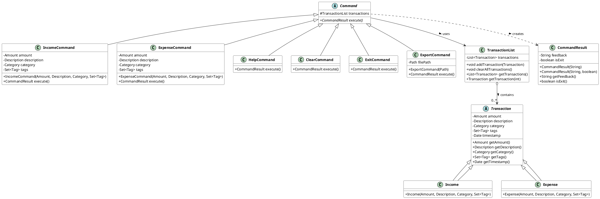
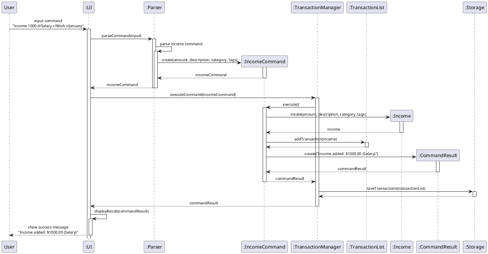

# Wang Yangming (Alan) - Project Portfolio Page

## Overview

Our team developed FinBro, a personal finance tracker application that helps users manage their income and expenses through a command-line interface. The application allows users to track financial transactions, generate reports, set budgets, track savings goals, and export data for further analysis. FinBro is designed to provide a streamlined yet powerful experience for personal finance management directly from the terminal.

## Summary of Contributions

### Code Contributed

[View my code on tP Code Dashboard](https://nus-cs2113-ay2425s2.github.io/tp-dashboard/?search=wang%20yangming)

My contributions focused primarily on the core architecture, data management components, and key transaction features that form the foundation of FinBro.

### Enhancements Implemented

1. **Core System Architecture and Framework**
    * Established the foundational project structure including model-view-controller architecture
    * Implemented the `TransactionManager` class that serves as the central hub for transaction processing
    * Created the storage system for persistent data management with automatic loading and saving
    * Designed a robust logging system to facilitate debugging and error tracking

2. **Transaction and Financial Data Management**
    * Implemented the transaction model classes (`Transaction`, `Income`, `Expense`) with proper inheritance
    * Created the currency formatting utility to ensure consistent monetary value presentation
    * Developed the core transaction operations (add, delete, list, filter, and search)
    * Designed the data export functionality for backup and external analysis

3. **Command Implementation and User Interaction**
    * Implemented essential commands:
        * `income`: Adds income transactions with optional details and tags
        * `expense`: Records expenses with category classification and tagging
        * `list`: Displays transactions with flexible filtering options
        * `export`: Exports financial data in CSV and TXT formats
        * `clear`: Removes all transaction data after confirmation
        * `help`: Provides comprehensive command guidance

4. **Testing and Quality Assurance**
    * Created comprehensive test cases for the storage component with 95% coverage
    * Developed test suites for transaction management and model classes
    * Implemented integration tests to ensure component interoperability
    * Added rigorous test validation for command execution logic

### Contributions to the User Guide

* **Structure and Organization**
    * Created the initial template and structure for the User Guide
    * Developed the document formatting standards used throughout the guide
    * Added comprehensive examples for each command to facilitate learning

* **Command Documentation**
    * Wrote detailed documentation for the following commands:
        * `income`: Recording income transactions
        * `expense`: Tracking expenses with categorization
        * `list`: Viewing transaction history
        * `export`: Exporting data for backup and analysis
        * `clear`: Clearing all transaction data
        * `help`: Getting assistance with commands

* **Technical Content**
    * Added installation and setup instructions
    * Documented data storage formats and locations
    * Created troubleshooting guidance for common issues

### Contributions to the Developer Guide

* **Architecture Documentation**
    * Created the high-level architecture diagram showing component interactions
    * Documented the storage and model components with class diagrams
    * Developed sequence diagrams for key transaction operations

* **Implementation Details**
    * Wrote comprehensive documentation for the following components:
        * Transaction management module
        * Command execution flow
        * Storage implementation with data persistence
        * Error handling and logging framework

* **Development Procedures**
    * Added appendices on coding standards and development workflow
    * Created documentation on testing protocols and requirements
    * Produced development setup guides for team members

### Contributions to Team-Based Tasks

* **Project Management**
    * Set up the GitHub repository with proper organization and structure
    * Established CI/CD workflows with GitHub Actions
    * Created issue templates and labeling conventions
    * Managed milestone planning and task allocation

* **Code Quality**
    * Performed code reviews to maintain consistent coding standards
    * Implemented logging throughout the application
    * Ensured proper error handling and exception management
    * Maintained consistent code style with checkstyle configuration

* **Integration and Testing**
    * Conducted system integration to ensure component compatibility
    * Developed the text-UI test infrastructure
    * Created test data generation utilities
    * Performed comprehensive application testing before releases

### Review/Mentoring Contributions

* Reviewed 25+ Pull Requests with detailed feedback
* Provided technical guidance on storage implementation and data persistence
* Assisted team members with debugging complex issues
* Conducted code review sessions to improve code quality and knowledge sharing

## Contributions to the Developer Guide (Extracts)

### Transaction Management Component

The Transaction Management component is responsible for processing financial transactions within the application. It maintains the core business logic that handles both income and expense operations.



#### Implementation

The Transaction Manager follows the Command pattern, where each financial operation is encapsulated as a command object:

```java
public abstract class Command {
    protected TransactionList transactions;
    
    public abstract CommandResult execute();
}
```

When a user enters a financial command, the following sequence of events occurs:

Income Command Sequence Diagram



### Storage Implementation

The Storage component handles data persistence in FinBro. It saves transaction data, budgets, and savings goals to files on disk and loads them when the application starts.

Key features of the Storage component:

1. **Transaction Persistence**: Stores all income and expense transactions with their details
2. **Budget Management**: Persists monthly budget settings
3. **Savings Goals**: Maintains savings targets across sessions
4. **Data Export**: Provides functionality to export data in various formats

The implementation uses a text-based storage format for simplicity and readability, with careful parsing logic to handle various data types and structures.

## Contributions to the User Guide (Extracts)

### Income Command

Adds an income entry to the finance tracker.

Format: `income`

When you enter this command, you'll be prompted to provide:
- The amount of income
- A description of the income source
- Up to 3 optional tags to categorize the income

Examples:
```
> income
Enter amount:
> 3000
Enter description:
> Monthly salary
Enter up to 3 tags (separated by space or comma), or press Enter to skip:
> Work, Primary

New income added: [Income] $3,000.00 - Monthly salary [Work, Primary]
```

### Expense Command

Adds an expense entry to the finance tracker.

Format: `expense`

When you enter this command, you'll be prompted to provide:
- The amount spent
- A description of the expense
- A category for the expense (from a predefined list)
- Up to 3 optional tags for additional categorization

Examples:
```
> expense
Enter amount:
> 25.50
Enter description:
> Lunch with colleagues
Please select a category by entering its corresponding index
0 - OTHERS
1 - FOOD
2 - TRANSPORT
3 - SHOPPING
4 - BILLS
5 - ENTERTAINMENT
> 1
Enter up to 3 tags (separated by space or comma), or press Enter to skip:
> Work

New expense added: [Expense][Food] $25.50 - Lunch with colleagues [Work]
```

### Export Command

Exports all financial records to a file format of your choice.

Format: `export`

When you enter this command, you'll be prompted to choose a format:
- CSV format (for spreadsheet applications)
- TXT format (for plain text viewing)

The export will include all transaction data, budget information, and savings goals.

Examples:
```
> export
Enter export format (csv/txt) or press Enter for default (csv):
> csv

Data exported successfully to: exports/finbro_export_20250406.csv
```