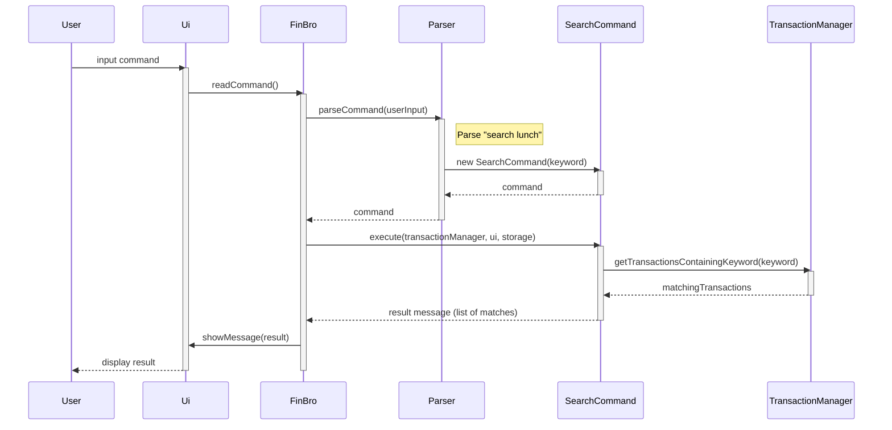

# Loke Mun Kong Denzel - Project Portfolio Page

## Overview

Our team developed FinBro, a personal finance tracker application designed for command-line interaction. It allows users to manage their income and expenses, search and filter transactions, and gain financial insights with minimal friction.

I focused on improving the user experience and robustness of FinBro by introducing interactive CLI prompts, defensive input handling, and transaction validation features.

---

## Summary of Contributions

### Code Contributed

[View my code on tP Code Dashboard](https://nus-cs2113-ay2425s2.github.io/tp-dashboard/?search=denzellee)

---

### Enhancements Implemented

1. **Interactive CLI Input Mode**
   * Enabled guided input mode for `income`, `expense`, and `search` commands
   * Implemented step-by-step prompting through `Parser.java` and `Ui.java` to improve user experience for new users


2. **Defensive Input Validation**
   * Created custom exceptions: `EmptyInputException`, `NegativeNumberException`, `DecimalPointException`
   * Enhanced `Ui.java` with robust `readDouble`, `readIndex`, and `readString` methods that validate and retry on bad input 
   * Prevented crashes from malformed or missing inputs with retry loops and informative error messaging


3. **Duplicate Transaction Detection**
   * Implemented duplicate detection for transactions based on amount and description in `TransactionManager`
   * Added confirmation prompt (`warnDuplicate`) in `Ui.java` to allow user decision on proceeding with duplicates


4. **Indexed Category Selection**
   * Built an index-based selection system for expense categories in `parseCategory(Ui ui)`
   * Improves discoverability and consistency of category assignment


5. **Search Feature**
   * Developed `SearchCommand` for keyword-based transaction lookup
   * Supports interactive prompt and case-insensitive matching in descriptions

---

### Contributions to the User Guide

- Documented:
  - Interactive usage of `income`, `expense`, and `search`
  - Duplicate transaction warning and confirmation flow
  - Category index selection table for expenses
  - New section: **Input Rules**
  - Enhanced **FAQ** with input-related error handling details

---

### Contributions to the Developer Guide

- Added:
  - UML class diagrams for `SearchCommand`
  - Sequence diagram for interactive income and search command execution
  - Descriptions of input validation strategy and defensive programming practices in `Ui.java`

---

### Contributions to Team-Based Tasks

- Helped establish unified CLI prompt formatting and input error conventions
- Supported testing and debugging of team features involving user interaction and input
- Participated in milestone discussions and documentation reviews

---

### Review/Mentoring Contributions

- Reviewed PRs related to CLI enhancements and parsing changes
- Provided feedback on improving error messaging and validating corner cases
- Helped teammate troubleshoot category parsing logic and recursive confirmation prompts

---
## Contributions to the Developer Guide (Extracts)

### Searching for a transaction


---
## Contributions to the User Guide (Extracts)

### 1. Recording Income

Records money received into your account.

**Format:** `income`, `AMOUNT`, `DESCRIPTION`. `[TAGS]`

**Parameters:**
* `AMOUNT`: A positive number with up to 2 decimal places
* `DESCRIPTION`: A brief description of the income source
* `TAGS`: Optional tags to categorize your income (can have 0-3)

**Examples:**
```
Enter Command Word:
> income
 
Enter Amount:
> 0.01

Enter Description:
> Monthly salary

Enter up to 3 tags (separated by space or comma), or press Enter to skip:
> Internship

```

**Enhanced Duplicate Detection**

FinBro automatically checks for **duplicate transactions** based on the same amount and description.

If duplicates are detected:
1. You will receive a **warning**
2. You’ll be asked to confirm whether you still want to proceed

This helps prevent accidental repeated entries.

---

### 2. Recording Expenses
Records money spent from your account.

**Format:** `expense`, `AMOUNT`, `DESCRIPTION`, `CATEGORY`, `[TAGS]`

**Parameters:**
* `AMOUNT`: A positive number with up to 2 decimal places
* `DESCRIPTION`: A brief description of the expense
* `CATEGORY`: One of: Food, Transport, Shopping, Bills, Entertainment, Others (defaults to Others if not specified)
* `TAG`: Optional tags for further categorization (can have 0-3 Tags)

**Example:**
```
Enter Command Word:
> expense
 
Enter Amount:
> 26.80

Enter Description:
> Chat subscription

Please select a category by entering its corresponding index
0 - OTHERS
1 - FOOD
2 - TRANSPORT
3 - SHOPPING
4 - BILLS
5 - ENTERTAINMENT
> 4

Enter up to 3 tags (separated by space or comma), or press Enter to skip:
>

```
---
### 3. Search Command
Finds transactions containing specific keywords.

**Format:** `search` `KEYWORD`

**Notes:**
* Search is case-insensitive
* Only the description field is searched
* Only transactions containing entire keyword will be shown

**Example:**
```
> search
Enter keyword or string to search:
> grocery lunch
```
---
