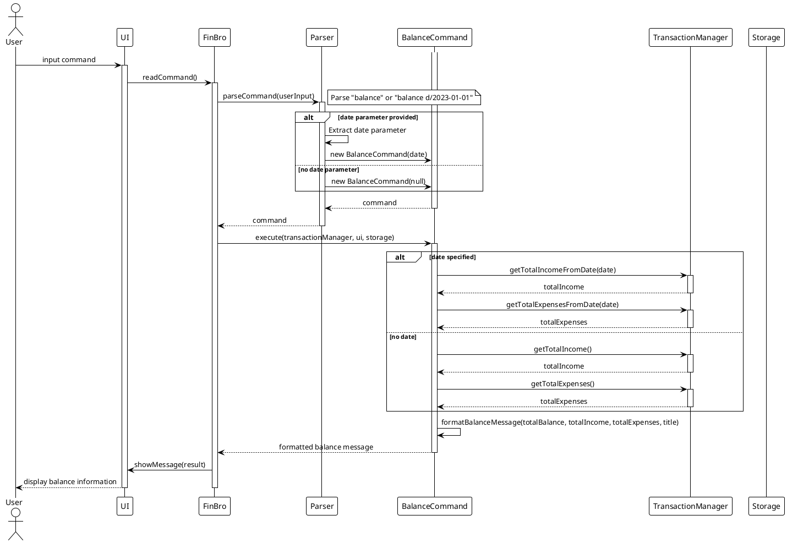
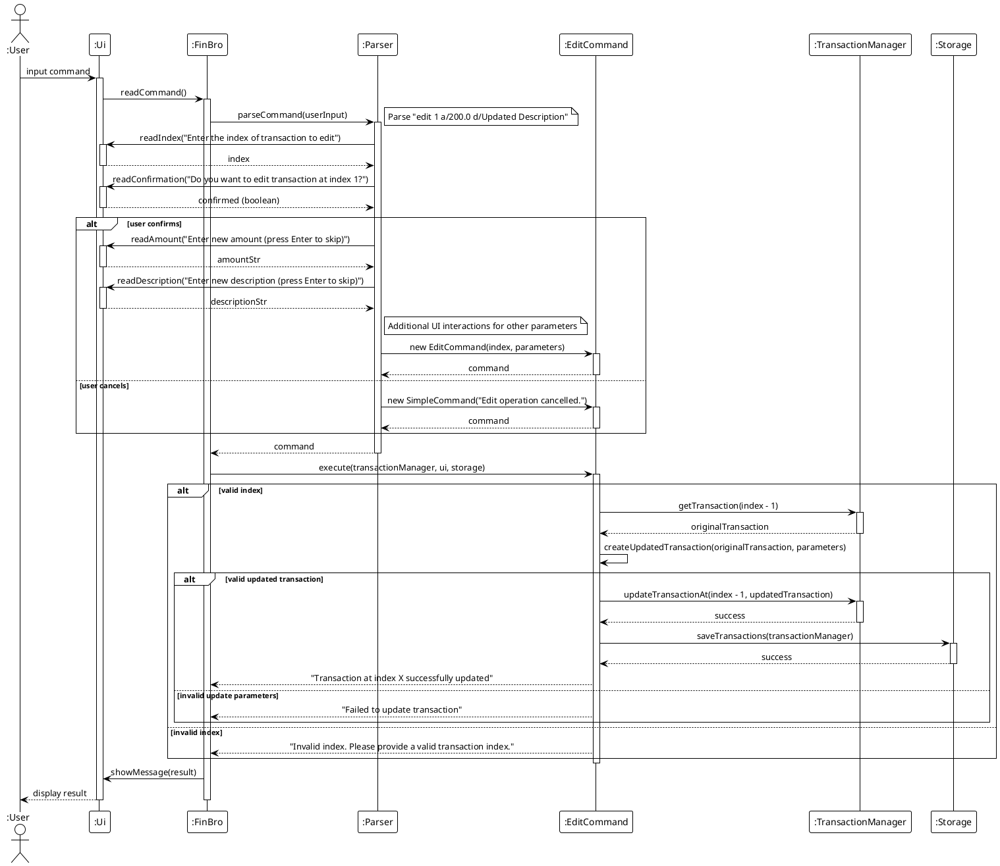

# Lim Jun Fun - Project Portfolio Page

## Overview
Our team developed FinBro, a personal finance tracker application designed for command-line interaction. It allows users to manage their income and expenses, search and filter transactions, and gain financial insights with minimal friction.

I have focused on implementing the some key functionalities for the application and implementing some JUnit test cases to ensure the application is working as intended.

---

### Code Contributed
[View my code on tP Code Dashboard](https://nus-cs2113-ay2425s2.github.io/tp-dashboard/?search=ljunfun&sort=groupTitle%20dsc&sortWithin=title&since=2025-02-21&timeframe=commit&mergegroup=&groupSelect=groupByRepos&breakdown=true&checkedFileTypes=docs~functional-code~test-code~other) 

---

### Enhancements Implemented

1. **Core Financial Commands in v1.0**
    * Implemented the following commands:
        * `view` / `balance`: Generates a report of expenses and income for the user to keep track
        * `edit`: Allows the user to update any entry he/she has made to the application
    * Enabled guided input mode for `edit` command.

2. **Enhancement of existing classes** 
    * Enchanced `Ui.java` with functions such as `readAmount`, `readDescription`, `readDate`, `readCategory` to enable smoother user input for the application and allows the user to input information as an option.
    * Reconfigured `LoggingConfig.java` to adjust the priority levels of logging, to not spam the user with all the logging messages that are unnecessary
    * Created `updateTransaction` and `getTransaction` for ease of use of EditCommand to amend anything within the transaction list.
3. **Implementation of JUnit Tests**
    * Implemented the JUnit tests for `EditCommand`, `BalanceCommand`, `ClearCommand`, `ClearCommand`,`LoggingConfig`, `SetBudgetCommandTest`, `SetSavingsGoalCommand`, `TrackBudgetCommand`, `TrackSavingsGoalCommand`, updated `Ui` Tests and     `Parser` Tests


---

### Contributions to the User Guide

- Documented:
  - Interactive usage of `view` / `balance` and `edit`
  - Provided examples for such use cases

---

### Contributions to the Developer Guide

- Added:
  - Sequence diagrams for `edit` and `view` / `balance` commands and their execution
  - Descriptions of the code for both `edit` and `view` / `balance`
  - `updateTransaction` and `getTransaction` workflow improvements

---

### Contributions to Team-Based Tasks

- Assisted in debugging and testing features related to user interactions. 
- Participated in milestone planning discussions and contributed to documentation reviews. 
- Contributed to team discussions on UI/UX enhancements and feature prioritization.

---

### Review/Mentoring Contributions

- Reviewed multiple Pull Requests, focusing on: Enhancements to `balance` command functionality
- Improvements in error messaging 
- Parser modifications and refinements 
- Provided feedback on handling corner cases and improving overall application reliability. 
- Assisted teammates in troubleshooting various errors and debugging challenges. 
- Guided team members on best practices for code modularization and refactoring.

## Contributions to the Developer Guide (Extracts)

### Viewing of Balance

The balance viewing feature follows this component interaction pattern:
1. **UI** captures the balance command with optional date parameters
2. **Parser** creates a BalanceCommand with specified date parameters
3. **BalanceCommand** requests balance calculation from TransactionManager
4. **TransactionManager** calculates balance based on all or filtered transactions
5. **BalanceCommand** formats and returns the balance information
6. **UI** displays the formatted balance to the user

**Implementation Details**

**Date-Filtered Balance Calculation**
```java
public String execute(TransactionManager transactionManager, Ui ui, Storage storage) {
   assert transactionManager != null : "TransactionManager cannot be null";
   assert ui != null : "UI cannot be null";
   assert storage != null : "Storage cannot be null";

   logger.info("Executing balance command");

   double balance = transactionManager.getBalance();
   double totalIncome = transactionManager.getTotalIncome();
   double totalExpenses = transactionManager.getTotalExpenses();

   // Verify the relationship between balance, income, and expenses
   assert Math.abs((totalIncome - totalExpenses) - balance) < 0.001 :
           "Balance calculation error: " + balance + " != " + totalIncome + " - " + totalExpenses;

   String formattedBalance = CURRENCY_FORMAT.format(balance);
   String formattedIncome = CURRENCY_FORMAT.format(totalIncome);
   String formattedExpenses = CURRENCY_FORMAT.format(totalExpenses);

   return "Current Balance: " + formattedBalance + "\n" +
           "Total Income: " + formattedIncome + "\n" +
           "Total Expenses: " + formattedExpenses;
}
```
**Key Design Features**

1. Flexible date filtering: Users can view overall balance or balance from a specific date
2. Comprehensive information: Shows income, expenses, and net balance in a single view
3. Clean formatting: Presents financial information in a well-organized, readable format
4. Integration with budgeting: Displays budget status when applicable
5. Error handling: Validates date parameters and provides clear error messages
6. Separation of concerns: Calculation logic remains in TransactionManager while presentation is handled by BalanceCommand

This implementation provides users with a quick overview of their financial position, either overall or from a specific date forward, enhancing financial awareness.

### Editing a Transaction

Editing a transaction also follows a similar component interaction pattern:

1. **UI** captures the edit command with a keyword and parameters to update
2. **Parser** creates an EditCommand with the specified keyword and parameters
3. **UI** asks for user confirmation before proceeding
4. **EditCommand** retrieves and updates the transaction at the specified index
5. **TransactionManager** updates the transaction in its collection
6. **Storage** persists the updated transaction list

**Implementation Details**

**Index-Based Transaction Selection**

```java
public String execute(TransactionManager transactionManager, Ui ui, Storage storage) {
   // Check if index is valid (1-based indexing for user interface)
   if (index < 1 || index > transactionManager.getTransactionCount()) {
      return "Invalid index. Please provide a valid transaction index.";
   }

   try {
      // Get original transaction (accounting for INDEX_OFFSET)
      Transaction originalTransaction = transactionManager.getTransaction(index - 1);

      // Create updated transaction based on parameters
      Transaction updatedTransaction = createUpdatedTransaction(originalTransaction, parameters);

      if (updatedTransaction != null) {
         // Replace transaction at index
         transactionManager.updateTransactionAt(index - 1, updatedTransaction);
         storage.saveTransactions(transactionManager);
         return "Transaction at index " + index + " successfully updated:\n" + updatedTransaction;
      }
      return "Failed to update transaction.";
   } catch (Exception e) {
      logger.log(Level.WARNING, "Error updating transaction", e);
      return "Failed to update transaction: " + e.getMessage();
   }
}
```

**User Confirmation via UI**

The parseEditCommand method in Parser.java now includes a confirmation step:
```java
private Command parseEditCommand(Ui ui) {
    try {
        // Get index of transaction to edit
        int index = ui.readIndex("Enter the index of transaction to edit:\n> ");
        
        // Add confirmation step
        boolean confirmed = ui.readConfirmation("Do you want to edit transaction at index " + index + "?");
        if (!confirmed) {
            return new Command() {
                @Override
                public String execute(TransactionManager transactionManager, Ui ui, Storage storage) {
                    return "Edit operation cancelled.";
                }
                
                @Override
                public boolean isExit() {
                    return false;
                }
            };
        }
        
        // Proceed with collecting parameters for the edit
        Map<String, String> parameters = new HashMap<>();
        
        // Collect parameters with UI interaction
        String amountStr = ui.readAmount("Enter new amount (press Enter to skip):\n> ");
        if (!amountStr.isEmpty()) {
            parameters.put("a", amountStr);
        }
        
        // [Additional parameter collection]
        
        return new EditCommand(index, parameters);
    } catch (Exception e) {
        logger.log(Level.WARNING, "Error parsing edit command", e);
        return new InvalidCommand("Invalid edit command: " + e.getMessage());
    }
}
```
**Transaction Update Logic**

The selective field update approach is retained:
```java
private Transaction createUpdatedTransaction(Transaction original, Map<String, String> parameters) {
    try {
        // Default values from original transaction
        double amount = original.getAmount();
        String description = original.getDescription();
        LocalDate date = original.getDate();
        List<String> tags = new ArrayList<>(original.getTags());
        
        // Update values based on parameters
        if (parameters.containsKey("a")) {
            amount = Double.parseDouble(parameters.get("a"));
        }
        if (parameters.containsKey("d")) {
            description = parameters.get("d");
        }
        if (parameters.containsKey("date")) {
            date = LocalDate.parse(parameters.get("date"));
        }
        if (parameters.containsKey("t")) {
            tags = Arrays.asList(parameters.get("t").split(","));
        }
        
        // Create new transaction based on the type of the original
        if (original instanceof Income) {
            return new Income(amount, description, date, tags);
        } else if (original instanceof Expense) {
            Expense originalExpense = (Expense) original;
            Expense.Category category = originalExpense.getCategory();
            
            if (parameters.containsKey("c")) {
                category = Expense.Category.fromString(parameters.get("c"));
            }
            
            return new Expense(amount, description, date, category, tags);
        }
        return null;
    } catch (NumberFormatException e) {
        logger.log(Level.WARNING, "Invalid amount format in edit command", e);
        return null;
    } catch (DateTimeParseException e) {
        logger.log(Level.WARNING, "Invalid date format in edit command", e);
        return null;
    }
}
```

**Key Design Features**

1. Direct index reference: Uses explicit index numbers for unambiguous transaction targeting
2. User confirmation: Prevents accidental edits through a confirmation prompt
3. Type preservation: Maintains the original transaction type (Income or Expense)
4. Selective updates: Only modifies fields explicitly specified in the edit command
5. Robust validation: Handles invalid indices, amounts, dates, and categories
6. 1-based user indexing: Presents user-friendly 1-based indexing while using 0-based indexing internally

This implementation balances user experience with data integrity and provides clear feedback throughout the editing process.


### Viewing Balance

This sequence diagram illustrates the process of viewing the current balance:



### Editing a Transaction

This sequence diagram illustrates the process of editing a transaction:
